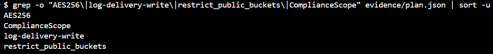
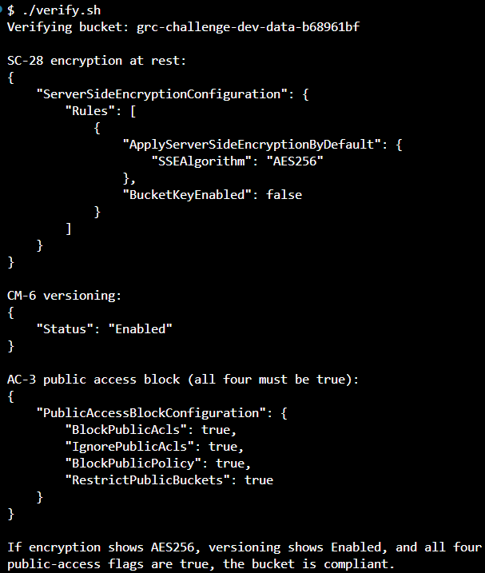
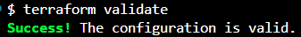

# Compliant S3 Bucket: NIST 800-53 (Week 1)

This Terraform module enforces **SC-28, AC-3, CM-6, and AU-3** on a cloud storage bucket and emits the proof as JSON. It provisions a primary S3 bucket and a dedicated access-log bucket, applies a compliance baseline to both, and generates a machine-readable `evidence/plan.json` that an automated check (or auditor) can scan to confirm each control is in place, before anything is deployed to AWS.

## What it enforces

| Control | Name | How it's satisfied | Resource(s) |
|---|---|---|---|
| **SC-28** | Protection of Information at Rest | Server-side encryption (AES-256) enabled by default on both buckets | `aws_s3_bucket_server_side_encryption_configuration` |
| **AC-3** | Access Enforcement | Public access blocked on all four independent flags on both buckets | `aws_s3_bucket_public_access_block` |
| **CM-6** | Configuration Settings | Versioning enabled on the primary bucket; four required tags applied to both buckets via provider `default_tags` | `aws_s3_bucket_versioning`, provider `default_tags` |
| **AU-3** | Content of Audit Records | Primary bucket access logging delivered to the dedicated log bucket (enables **AU-6** review downstream) | `aws_s3_bucket_ownership_controls`, `aws_s3_bucket_acl`, `aws_s3_bucket_logging` |

Both S3 buckets carry four tags via the provider `default_tags` block: `Project`, `Environment`, `ManagedBy`, and `ComplianceScope`. The buckets are the only taggable resources in this module; the configuration resources (encryption, versioning, public access block, logging) are settings on a bucket, not taggable objects, so AWS gives them no place to hold tags.

## Architecture

- **Primary bucket**: holds data. Encrypted, versioned, public access blocked, access logging enabled.
- **Log bucket**: receives the primary bucket's access logs. Encrypted, public access blocked, ownership controls + log-delivery ACL so it can accept log delivery.

## Repository layout

```
.
├── main.tf                 # provider, buckets, and the NIST controls
├── variables.tf            # input variables (region, project_name, environment)
├── outputs.tf              # bucket identifiers + SC-28 encryption attestation
├── verify.sh               # post-apply live checks (encryption, versioning, public access)
├── terraform.tfvars.example
└── evidence/
    └── plan.json           # machine-readable proof of the controls
```

## Reproduce the evidence

The evidence is plan-only, so it creates nothing in AWS and costs effectively nothing. The AWS provider still needs valid credentials to read and refresh state.

```bash
cp terraform.tfvars.example terraform.tfvars   # edit values if you like

terraform init
terraform validate
terraform plan -out=tfplan
terraform show -json tfplan > evidence/plan.json
```

## Apply (optional)

Applying creates real S3 buckets in AWS. Terraform prints the plan and waits for you to confirm with `yes`.

```bash
terraform apply
```

## How to verify

### From the evidence file (no AWS access required)

Confirm all four control signatures are present in `evidence/plan.json`:

```bash
grep -o "AES256\|log-delivery-write\|restrict_public_buckets\|ComplianceScope" evidence/plan.json | sort -u
```

Expected output:



| Signature | Control | Proves |
|---|---|---|
| `AES256` | SC-28 | Server-side encryption rule is set |
| `restrict_public_buckets` | AC-3 | Public access block present (all four flags `true`) |
| `ComplianceScope` | CM-6 | Required tags applied; versioning shows `"status":"Enabled"` |
| `log-delivery-write` | AU-3 | Log-delivery ACL and `logging` block present |

### Against live AWS (only if you ran `terraform apply`)

```bash
./verify.sh
```

This queries the deployed bucket and confirms `AES256` encryption, versioning `Enabled`, and all four public-access flags `true`.



## The challenging part: AU-3 logging sequence

On modern AWS, new buckets default to `BucketOwnerEnforced`, which disables the ACLs that S3 log delivery still relies on. The order must be:

1. Set object ownership to `BucketOwnerPreferred` (re-enables ACLs).
2. Apply the `log-delivery-write` ACL to the log bucket.
3. Point the primary bucket's logging at the log bucket.

`depends_on` locks this sequence so it applies correctly every time. Get the order wrong and you get `AccessDenied` (or logs silently never deliver).

## Teardown (only if you applied)

Versioned buckets will not destroy while they hold object versions. Empty them first, then:

```bash
terraform destroy
```

## Completion checklist

- `terraform validate` passes (see screenshot below)
- `evidence/plan.json` contains all the control requirements: the encryption rule, the four-flag public access block, versioning enabled, the four tags, and the logging target
- `verify.sh` confirms AES256, versioning Enabled, and all four public-access flags true



## Resources

- [YouTube Walkthrough](https://youtu.be/Jtd0snHKdms)
- [6-Week GRC Pipeline Challenge](https://www.patreon.com/GRCEngineeringClub/posts/6-week-grc-build-161004225)

---
