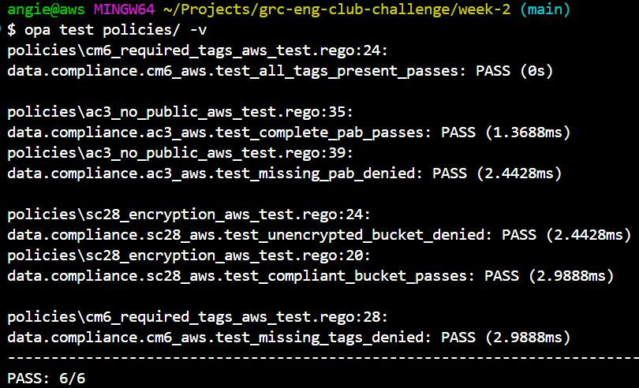
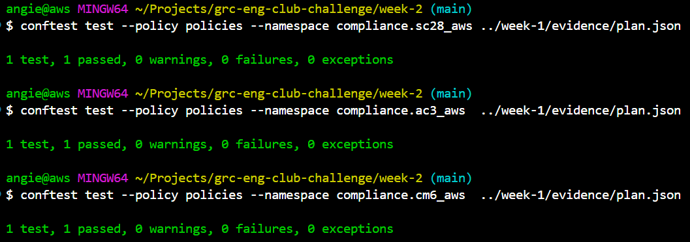
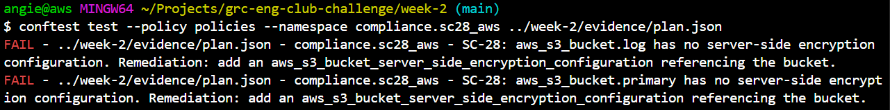

# Executable Compliance Policies: NIST 800-53 (Week 2)

This is a policy library written in Rego, the language behind Open Policy Agent (OPA). It reads a Terraform plan in JSON and returns a machine verdict on each control, the same way every time. It turns the week 1 controls from a claim someone has to check into code that checks itself. The same policies run as unit tests against fixtures and as a gate (via Conftest) against the real week 1 `evidence/plan.json`.

## What it enforces

| Control | Name | What the policy denies | Policy |
|---|---|---|---|
| **SC-28** | Protection of Information at Rest | Any `aws_s3_bucket` with no matching server-side encryption configuration | `policies/sc28_encryption_aws.rego` |
| **AC-3** | Access Enforcement | Any `aws_s3_bucket` whose public access block is missing or has any of its four flags not set to `true` | `policies/ac3_no_public_aws.rego` |
| **CM-6** | Configuration Settings | Any taggable resource missing one of the four required tags (`Project`, `Environment`, `ManagedBy`, `ComplianceScope`) | `policies/cm6_required_tags_aws.rego` |

Each policy ships with a test file that defines two cases: a compliant plan that must produce zero denials, and a broken plan that must produce a denial. Those tests are the spec.

## The match-by-reference technique

At plan time, a bucket's final name is unknown, because the `random_id` suffix has not been generated yet. So you cannot match an encryption resource to its bucket by comparing names. You match by reference instead.

In the plan JSON, an encryption resource records that its `bucket` argument references a string like `"aws_s3_bucket.primary.id"`. The policy reads `input.configuration.root_module.resources[].expressions.bucket.references` and checks whether any encryption resource points at the bucket's address, rather than trusting a value that does not exist yet. SC-28 and AC-3 both rely on this. CM-6 is simpler, because tags are concrete values read from `input.planned_values.root_module.resources[].values.tags_all`.

## Repository layout

```
.
├── policies/
│   ├── sc28_encryption_aws.rego         # SC-28 policy
│   ├── sc28_encryption_aws_test.rego    # SC-28 spec (compliant + broken)
│   ├── ac3_no_public_aws.rego           # AC-3 policy
│   ├── ac3_no_public_aws_test.rego      # AC-3 spec
│   ├── cm6_required_tags_aws.rego       # CM-6 policy
│   └── cm6_required_tags_aws_test.rego  # CM-6 spec
└── evidence/
    └── plan-broken.json                 # week 1 plan with encryption removed, to prove the gate fails
```

## Run the unit tests

The tests are self-contained: each carries small mock plans, so no AWS or Terraform is needed.

```bash
opa test policies/ -v
```

Expected result, six passing:



## Gate the real week 1 plan

Point the same policies at the compliant plan generated in week 1 (`week-1/evidence/plan.json`) using Conftest. The package declaration in each policy is the namespace you pass.

```bash
conftest test --policy policies --namespace compliance.sc28_aws ../week-1/evidence/plan.json
conftest test --policy policies --namespace compliance.ac3_aws  ../week-1/evidence/plan.json
conftest test --policy policies --namespace compliance.cm6_aws  ../week-1/evidence/plan.json
```

All three pass against the compliant plan:



## Prove the gate has teeth

A gate that never fails is worthless. To prove it catches real violations, copy the week 1 plan, delete both encryption blocks, and run SC-28 against the copy:

```bash
conftest test --policy policies --namespace compliance.sc28_aws ./evidence/plan-broken.json
```

It fails, and each failure names the resource and the remediation:



## Completion checklist

- `opa test policies/ -v` reports 6/6 passing
- All three policies pass against the compliant week 1 plan via Conftest
- SC-28 fails against a plan with encryption removed, naming the resource and the fix

## Resources

- [Week 1: Compliant S3 Bucket](https://github.com/angie-in-the-cloud/grc-eng-club-challenge/tree/main/week-1)
- [6-Week GRC Pipeline Challenge](https://www.patreon.com/GRCEngineeringClub/posts/6-week-grc-build-161004225)

---
