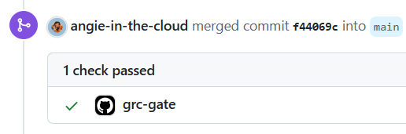
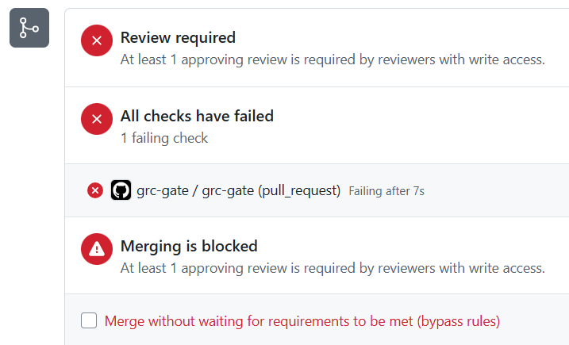

# Build the Gate: Compliance-as-Code in CI (Week 3)

Week 2 turned three NIST 800-53 controls into executable Rego policies. Running them on a laptop catches your own mistakes. This week wires those same policies into a **GitHub Actions gate** that runs on every pull request to `main` and **blocks the ones that break a control** automatically, in seconds, before a human is ever involved.

Nobody reviews the change for encryption. The pipeline does. A person only gets pulled in when something is actually wrong.

## What the gate enforces

On every pull request to `main`, the [`grc-gate`](../.github/workflows/grc-gate.yml)
workflow runs the week 2 policy library (`week-2/policies`) against a committed
Terraform plan (`week-3/plan.json`) across three control namespaces:

| Namespace | Control | Denies |
|---|---|---|
| `compliance.sc28_aws` | **SC-28** Protection of Information at Rest | Any `aws_s3_bucket` with no matching server-side encryption configuration |
| `compliance.ac3_aws` | **AC-3** Access Enforcement | Any `aws_s3_bucket` whose public access block is missing or has any of its four flags not `true` |
| `compliance.cm6_aws` | **CM-6** Configuration Settings | Any taggable resource missing one of the four required tags (`Project`, `Environment`, `ManagedBy`, `ComplianceScope`) |

## What happens when a control breaks

If any namespace reports a failure, the job exits non-zero and the `grc-gate`
check goes red. With branch protection requiring `grc-gate`, **the pull request
cannot be merged by anyone until the violation is fixed.** That is the entire
value proposition: a blocked merge beats a caught mistake, because the mistake
never merges.

Either way, pass or fail, the run uploads `evidence/conftest-results.json` as a
build artifact to GitHub Actions' own **Artifacts** storage, so there is a durable,
machine-readable record of the verdict.

## How the workflow is built

The workflow lives at the **repo root** (`.github/workflows/grc-gate.yml`),
because GitHub Actions only runs workflows found there. It reuses the week 2
policies directly rather than duplicating them, so there is one source of truth.

Three details that make it a real gate rather than theater:

1. **Explicit permissions.** A workflow gets minimal permissions by default. The
   job sets `contents: read` and `pull-requests: write` explicitly.
2. **Evidence saved on failure.** The upload step runs with `if: always()`, so
   the evidence survives a failed run. Capturing evidence only on success would
   defeat the purpose.
3. **Fail closed.** `set -o pipefail` preserves Conftest's non-zero exit code
   even though the output is piped through `tee` to capture the JSON. The exit
   code is never ignored, so any violation fails the build.

## The plan, the simple way

This week uses the free, no-secrets path: the Terraform plan is generated locally
and committed as `week-3/plan.json`. CI runs Conftest against that committed file
so there are no cloud credentials, no stored keys, nothing to pay for.
`week-3/plan.json` is a copy of the compliant week 1 plan, which lives here: `week-1/evidence/plan.json`.

To regenerate it from the week 1 workspace:

```bash
cd week-1
terraform plan -out=tfplan
terraform show -json tfplan > ../week-3/plan.json
```

## The two-PR demonstration (the deliverable)

1. **Green PR.** Open a PR with the compliant `week-3/plan.json`. Every policy
   passes, `grc-gate` goes green, the PR is mergeable.
2. **Red PR.** Open a PR where the plan violates a control. For example, swap in
   the encryption-removed plan from week 2
   (`cp week-2/evidence/plan-broken.json week-3/plan.json`) or flip one
   public-access flag to `false` and regenerate. `grc-gate` goes red.

Then turn on branch protection (**Settings → Branches**) and require the
`grc-gate` check. Now the red PR genuinely cannot be merged until it is fixed.

### Evidence

**Green PR: compliant plan, check passes, merge allowed:**



**Red PR: encryption removed, check fails, merge blocked:**



## Done when

- A PR triggers the workflow and it appears in the **Actions** tab.
- The compliant PR ends green; the violating PR ends red and is blocked.
- An evidence artifact is attached to both runs.

## Optional: Generate the plan in CI with OIDC

The production version has CI generate the plan itself by assuming an AWS role 
through **GitHub OIDC**, so there are no stored keys. 

Two important things to note: 
- Bind the trust to your exact repository (`repo:angie-in-the-cloud/grc-eng-club-challenge:*`, 
never a wildcard)
- Give the role read-only access. 
- Keyless beats stored credentials because there is no long-lived secret to leak or rotate.

