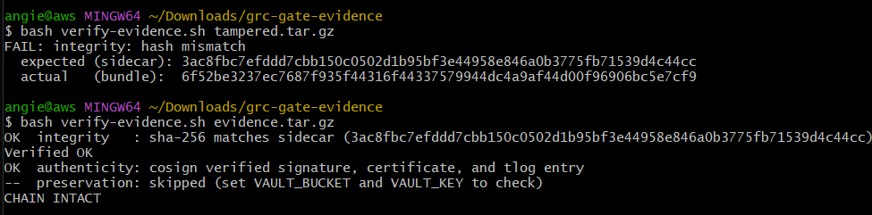

# Evidence You Can Trust (Week 4)

Chain of custody means anyone can prove your evidence is authentic and untouched, without trusting you. You build two things: a signing step that runs in your pipeline, and a verify script that checks the result.

## The signing step (you add it to week 3's workflow)

After your gate produces `evidence/`, add a step that:

1. Bundles `evidence/` into a single `.tar.gz`.
2. Writes the bundle's SHA-256 to a `.sha256` sidecar file.
3. Signs the bundle with Cosign, keyless: `cosign sign-blob --yes --bundle evidence.sig.bundle <bundle>`.

Keyless signing means no private key. In GitHub Actions, Cosign uses the workflow's OIDC token, so the signature is tied to your pipeline run. The job needs `permissions: id-token: write` or the signing fails. The `--bundle` file packs the signature, the certificate, and the transparency-log entry into one file your verifier reads.

You can also sign locally to learn the flow: `cosign sign-blob` will open a browser for a one-time identity check. Still free, still keyless.

## The verify script (fill in verify-evidence.sh)

Three checks, each exits non-zero on failure:

1. **Integrity.** Recompute the SHA-256, compare to the sidecar.
2. **Authenticity.** `cosign verify-blob` against the `.sig.bundle`, pinning the OIDC issuer.
3. **Preservation** (stretch). If you used a vault, confirm the Object Lock retention is still in the future.

Print `CHAIN INTACT` only if all checks pass.

## The tamper test (this is the deliverable)

```bash
cp evidence.tar.gz /tmp/tampered.tar.gz
echo "junk" >> /tmp/tampered.tar.gz
./verify-evidence.sh /tmp/tampered.tar.gz   # must FAIL on integrity
./verify-evidence.sh evidence.tar.gz        # must say CHAIN INTACT
```

One changed byte breaks the chain. That failure is the whole point: custody is mathematical, not a promise.

## Cost

Free. Sigstore signing and verification cost nothing and need no cloud account. The only paid piece is the optional vault, which is pennies and gets torn down.

## Stretch: the immutable vault

For true preservation, upload the signed bundle to an S3 bucket with Object Lock and versioning on, so nobody can overwrite or delete it. Apply it, push one bundle, verify retention, then tear it down the same day. The brief covers the setup and teardown.

---

## What I built

**The signing step** lives in [`.github/workflows/grc-gate.yml`](../.github/workflows/grc-gate.yml). After the gate produces `evidence/`, the workflow:

1. Bundles `evidence/` into `evidence.tar.gz`.
2. Writes the archive's SHA-256 to `evidence.tar.gz.sha256`.
3. Signs the archive keyless with `cosign sign-blob --yes --bundle evidence.sig.bundle evidence.tar.gz`, producing a bundle that holds the signature, the certificate, and the transparency-log entry.

Two details that make it work: the job has `permissions: id-token: write` so Cosign can mint its OIDC token, and the pass/fail decision is the **last** step (`Enforce gate verdict`) so signing runs even when the policy gate fails. A failed run is exactly the evidence worth preserving.

**The verify script** is [`verify-evidence.sh`](verify-evidence.sh). It runs the three checks below and prints `CHAIN INTACT` only if all pass.

## Chain of custody: four properties, four artifacts

| Property | Question it answers | Proven by | Where |
|---|---|---|---|
| **Authenticity** | Who produced this? | Sigstore certificate binding the signature to this repo's `grc-gate.yml` workflow run (keyless OIDC identity) | `evidence.sig.bundle` → `cosign verify-blob` with pinned issuer + identity |
| **Integrity** | Has it changed since? | SHA-256 of the bundle, recomputed and compared | `evidence.tar.gz.sha256` sidecar |
| **Timeliness** | When was it produced? | Signed timestamp in the Rekor transparency-log entry | `evidence.sig.bundle` (verified by `cosign verify-blob`) |
| **Preservation** | Can it still be retrieved, unaltered? | S3 Object Lock retention date in the future (stretch) | `aws s3api get-object-retention` |

Why keyless beats a stored key: there is no long-lived private key to leak, rotate, or lose. The certificate encodes *which repo and which workflow* signed, and that proof lives in Sigstore's public log, not in my cloud account. Even an admin in my AWS account cannot forge it, because the identity isn't stored in my infrastructure.

## The tamper test (the deliverable)

Run after downloading the `grc-gate-evidence` artifact (or from a local `cosign sign-blob` run) so `evidence.tar.gz`, `evidence.tar.gz.sha256`, and `evidence.sig.bundle` sit in the current directory:

```bash
# Tamper: copy the bundle and append a few junk bytes
cp evidence.tar.gz tampered.tar.gz                  # 1. copy the real bundle
cp evidence.tar.gz.sha256 tampered.tar.gz.sha256    # 2. copy the real bundle's hash
echo "junk" >> tampered.tar.gz                      # 3. modify the copy by appending junk bytes

# Fails immediately on integrity -- the hash no longer matches
./verify-evidence.sh tampered.tar.gz

# The real bundle -- prints CHAIN INTACT
./verify-evidence.sh evidence.tar.gz
```

Appended bytes break the chain: the recomputed hash no longer matches the sidecar, and the signature was computed over the original bytes. Custody is mathematical, not a promise.

### Screenshot of both runs (the failed tampered check and the passing `CHAIN INTACT`).



---

## The immutable vault (stretch, completed)

The vault lives in [`vault/`](vault/) as its own small Terraform config, separate from the signing pipeline above because it is optional infrastructure, not something every gate run needs.

`vault/main.tf` builds an S3 bucket with `object_lock_enabled = true` -- a setting that can only be applied at bucket creation, never added later. A default retention rule in **COMPLIANCE** mode is attached, so every object uploaded is automatically protected: nobody, including the account root user, can shorten or delete that retention before it expires. Retention is currently set to 1 day (`retention_days` in `terraform.tfvars`) to keep the demonstration cheap and fast to verify; the value is a single variable, so a longer retention window for a production case is a one-line change.

```bash
cd vault
terraform apply
BUCKET=$(terraform output -raw vault_bucket_name)
aws s3 cp ../evidence/evidence.tar.gz "s3://$BUCKET/evidence.tar.gz"
aws s3 cp ../evidence/evidence.tar.gz.sha256 "s3://$BUCKET/evidence.tar.gz.sha256"
aws s3 cp ../evidence/evidence.sig.bundle "s3://$BUCKET/evidence.sig.bundle"
aws s3api get-object-retention --bucket "$BUCKET" --key evidence.tar.gz
```

```json
{
    "Retention": {
        "Mode": "COMPLIANCE",
        "RetainUntilDate": "2026-07-23T20:01:10.397000+00:00"
    }
}
```

With the bundle in the vault, `verify-evidence.sh`'s preservation check -- which prints `-- preservation: skipped` everywhere else in this repo, since no vault is set -- finally has something to check against:

```bash
SIG_BUNDLE=evidence/evidence.sig.bundle \
VAULT_BUCKET="<vault bucket name>" \
VAULT_KEY="evidence.tar.gz" \
./verify-evidence.sh evidence/evidence.tar.gz
```

```
OK  integrity   : sha-256 matches sidecar
OK  authenticity: cosign verified signature, certificate, and tlog entry
OK  preservation: object-lock retained until 2026-07-23T20:01:10.397000+00:00
CHAIN INTACT
```

All four chain-of-custody properties -- authenticity, integrity, timeliness, and preservation -- verified in one run, against one bundle.


---
