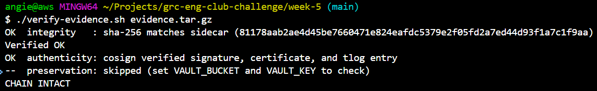
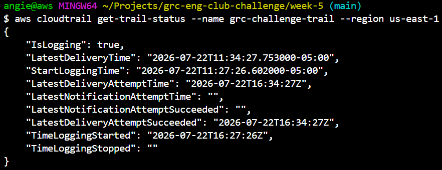
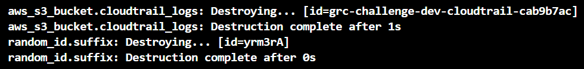

# Week 5 starter: Turn On the Cameras

This is the one week that touches billable AWS services. The starter gives you a `teardown.sh` so you can shut it all down the same day. The Terraform is yours to write.

## Cost

- **CloudTrail** management events are free. Do not enable data events.
- **Security Hub** bills roughly $0.001 per check. The NIST 800-53 standard is a few hundred checks, so under about $1 per month, and pennies if you tear down within the hour.
- **AWS Config** costs more and is often blocked by an org policy. It is optional this week. Skip it unless you want it.

If you apply and destroy the same day, expect well under $1. If you walk away and leave it running, it adds up slowly. **Tear it down.**

---

## What I built

**Terraform** lives in [`main.tf`](main.tf), [`variables.tf`](variables.tf), and [`outputs.tf`](outputs.tf). One apply creates:

1. A private, encrypted, versioned S3 bucket (`aws_s3_bucket.cloudtrail_logs`) for CloudTrail's logs, with public access fully blocked -- the same SC-28 / AC-3 pattern from week 1, reused here because it is the same control.
2. A bucket policy (`aws_s3_bucket_policy.cloudtrail_logs`) allowing the CloudTrail service principal to check the bucket ACL and write objects, both statements scoped with an `aws:SourceArn` condition pointing at this specific trail's ARN. The trail's ARN is deterministic from its name, region, and account ID, so it can be referenced in the policy without creating a circular dependency on the trail resource itself.
3. A multi-region `aws_cloudtrail` trail with `enable_log_file_validation = true`. Maps **AU-2** (I chose what gets recorded), **AU-12** (audit record generation across the account), and **AU-10** (non-repudiation -- the hourly signed digest proves the log records have not been altered after the fact).
4. `aws_securityhub_account` and `aws_securityhub_standards_subscription`, subscribing the NIST 800-53 Rev 5 standard (`arn:aws:securityhub:us-east-1::standards/nist-800-53/v/5.0.0`). Maps **RA-5** (configuration/vulnerability scanning) and **SI-4** (system monitoring).

## Two snags this week that were not in the brief

**Security Hub was already enabled -- and importing it was not enough on its own.** This AWS account is the management account of an existing Organization, and Security Hub had been subscribed here since September 2025, with eleven other product integrations (GuardDuty, Macie, Inspector, Config, Access Analyzer, and others) already wired into it. `terraform import aws_securityhub_account.this[0] <ACCOUNT_ID>` pulled it into state as the README says, but the very next `plan` showed Terraform wanting to **destroy and recreate** the account anyway, because the real account had `enable_default_standards = false` and my config left that attribute unset, so Terraform defaulted it to `true`. Replacing the account would have briefly disabled Security Hub and silently turned on AWS's default standards (CIS, Foundational Security Best Practices) alongside NIST 800-53 -- checks I never asked for and would have paid for. Fix: pin `enable_default_standards = false` explicitly, so the config matches reality and nothing gets replaced.

**The NIST 800-53 standard came back `INCOMPLETE`, not with findings.** After the wait, `aws securityhub get-findings` (filtered to `ComplianceAssociatedStandardsId`) returned zero results. `aws securityhub get-enabled-standards` explained why:

```json
"StandardsStatus": "INCOMPLETE",
"StandardsStatusReason": { "StatusReasonCode": "NO_AVAILABLE_CONFIGURATION_RECORDER" }
```

The brief predicted a *specific* finding titled "AWS Config should be enabled" among a few hundred passing checks. What actually happened is one level more fundamental: the org SCP that blocks AWS Config blocks the entire standard from evaluating *any* control, because Security Hub's NIST 800-53 checks read from Config's configuration recorder. Zero individual findings, but a precisely-named, machine-generated reason why -- which is the same documented-gap lesson the brief describes, just surfaced a layer deeper than expected. I captured both the (empty) findings file and the standard's status as evidence, since the absence of findings *is* the finding here.

## Teardown: also not quite the textbook path

Because Security Hub predated this challenge and other integrations depend on it staying enabled, a full `terraform destroy` would have disabled it account-wide -- collateral damage well outside the scope of this week. Instead:

```bash
terraform state rm 'aws_securityhub_account.this[0]'
```

removed only Terraform's *tracking* of that resource, without calling any AWS API, so `destroy` left the pre-existing Security Hub account untouched and only removed what this week actually added: the standard subscription, the trail, and the bucket.

The bucket itself also refused to delete on the first pass (`BucketNotEmpty`) because CloudTrail had already written log and digest files into it and versioning was on, so `destroy` alone does not clear old object versions. Emptying it required an explicit version-aware delete (`aws s3api list-object-versions` piped into `aws s3api delete-objects`) before `terraform destroy` could finish.

## Chain of custody

`evidence/security-hub-standard-status.json` and `evidence/security-hub-findings.json` were bundled, hashed, and signed the same way week 4 built:

```bash
tar -czf evidence.tar.gz -C evidence .
sha256sum evidence.tar.gz | awk '{print $1}' > evidence.tar.gz.sha256
cosign sign-blob --yes --bundle evidence.sig.bundle evidence.tar.gz
```

Signed locally this time rather than through the `grc-gate` GitHub Actions workflow, so the certificate's identity is a personal GitHub OAuth login (`github.com/login/oauth`) rather than the CI workflow. Verifying it means pointing `verify-evidence.sh` at that identity instead of the default:

```bash
OIDC_ISSUER="https://github.com/login/oauth" \
CERT_IDENTITY_REGEXP="<signer email>" \
./verify-evidence.sh evidence.tar.gz
```

```
OK  integrity   : sha-256 matches sidecar
OK  authenticity: cosign verified signature, certificate, and tlog entry
--  preservation: skipped (no vault this week)
CHAIN INTACT
```



## Evidence

**CloudTrail logging confirmed:**



**Teardown complete, nothing left billing:**



```bash
aws cloudtrail describe-trails --region us-east-1        # "trailList": []
aws securityhub get-enabled-standards --region us-east-1  # "StandardsSubscriptions": []
```

## Done when

- [x] `aws cloudtrail get-trail-status` showed `IsLogging: true` while the trail was up.
- [ ] `aws securityhub get-findings` returned at least one finding -- did not happen; see "Two snags" above for why, and why the absence is itself documented evidence.
- [x] `evidence/security-hub-standard-status.json` and `evidence/security-hub-findings.json` captured, signed, and verified `CHAIN INTACT`.
- [x] `terraform destroy` completed and nothing is left billing (Security Hub's pre-existing account excluded intentionally; see teardown section).

## Cost discipline

Applied and torn down the same day. Total run time from `apply` to `destroy`: under an hour.

---
