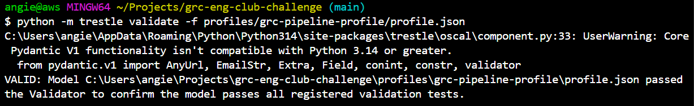
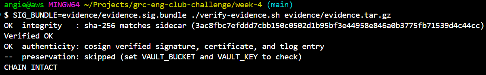

# Week 6: Speak the Auditor's Language

Two builds this week: an OSCAL control mapping authored with `trestle`, and the portfolio case study that presents all six weeks as one pipeline.

## Cost

Free. OSCAL is just JSON in the repo. There's nothing to deploy, nothing to tear down.

--

## What I built

**`component-definitions/my-pipeline/component-definition.json`** - one component ("GRC Pipeline") with four `implemented-requirement` entries, one per control from week 1:

| Control | Implementation resource | Evidence |
|--|--|--|
| **SC-28** | `aws_s3_bucket_server_side_encryption_configuration.primary` | `week-4/evidence/evidence.tar.gz` |
| **AC-3** | `aws_s3_bucket_public_access_block.primary` | `week-4/evidence/evidence.tar.gz` |
| **AU-3** | `aws_s3_bucket_logging.primary` | `week-4/evidence/evidence.tar.gz` |
| **CM-6** | `provider.aws.default_tags` | `week-4/evidence/evidence.tar.gz` |

All four link to the same evidence bundle, because week 4's pipeline signs everything in `evidence/` together, in one archive. Each `implemented-requirement` also carries a `remarks` field pointing out that the `.sha256` sidecar and `.sig.bundle` signature sit alongside the bundle at the same path, and naming `week-4/verify-evidence.sh` as the script that checks all three together - rather than linking all three files separately on every control, which is repetitive and not how a real OSCAL document is usually shaped.

**`profiles/grc-pipeline-profile/profile.json`** - imports the public NIST 800-53 Rev 5 catalog and selects exactly those four control IDs (`sc-28`, `ac-3`, `au-3`, `cm-6`) under `include-controls`. Nothing else.

Both validate clean:

```bash
trestle validate -f component-definitions/my-pipeline/component-definition.json
trestle validate -f profiles/grc-pipeline-profile/profile.json
```



## Two snags

**`trestle` wasn't on PATH after installing.** `pip install compliance-trestle` completed fine, but the bare `trestle` command wasn't found. `python -m trestle <command>` worked immediately without touching PATH, so that is what every command above actually uses.

**A hand-typed UUID slipped in.** While authoring the `party` entry for the component definition's metadata, one UUID was typed by hand in a v4-shaped pattern rather than actually generated by `uuid.uuid4()` - exactly the shortcut this week's brief warns against. It happened to pass schema validation, since the format looked right, but it was not genuinely random. Caught on review and replaced with a real `uuid.uuid4()` output before committing. Every UUID in the final file is machine-generated.

## Prove the traversal (the deliverable)

SC-28 is the one the brief calls out as the clean one. Following its evidence link end to end:

```bash
cd week-4
SIG_BUNDLE=evidence/evidence.sig.bundle ./verify-evidence.sh evidence/evidence.tar.gz
```

```
OK  integrity   : sha-256 matches sidecar (3ac8fbc7efddd7cbb150c0502d1b95bf3e44958e846a0b3775fb71539d4c44cc)
OK  authenticity: cosign verified signature, certificate, and tlog entry
-  preservation: skipped (set VAULT_BUCKET and VAULT_KEY to check)
CHAIN INTACT
```



That is the whole point of this week: someone reads the component definition, follows SC-28's `href`, downloads the same three files straight from this repo, runs the same verify script, and confirms the claim is real - without ever asking me to prove it.

## Done when

- [x] `trestle validate` returns `VALID` for both the component definition and the profile.
- [x] SC-28's evidence link resolves to the real signed bundle at `week-4/evidence/evidence.tar.gz`, and `verify-evidence.sh` against it prints `CHAIN INTACT`.
- [x] Case study published at the top of the repo, linking back here.

---
